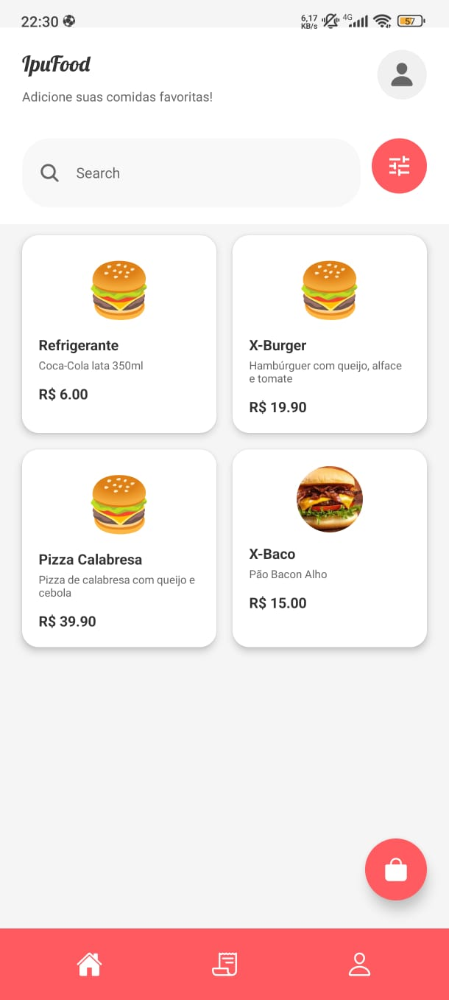
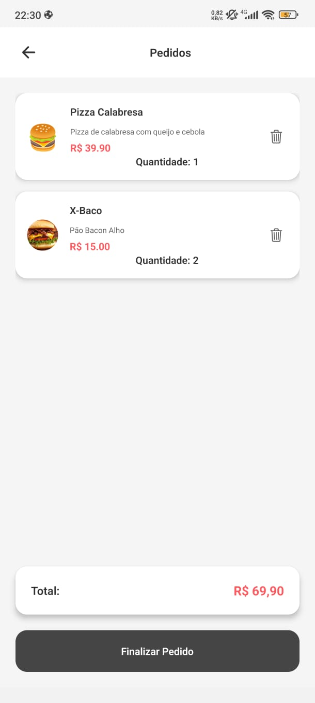
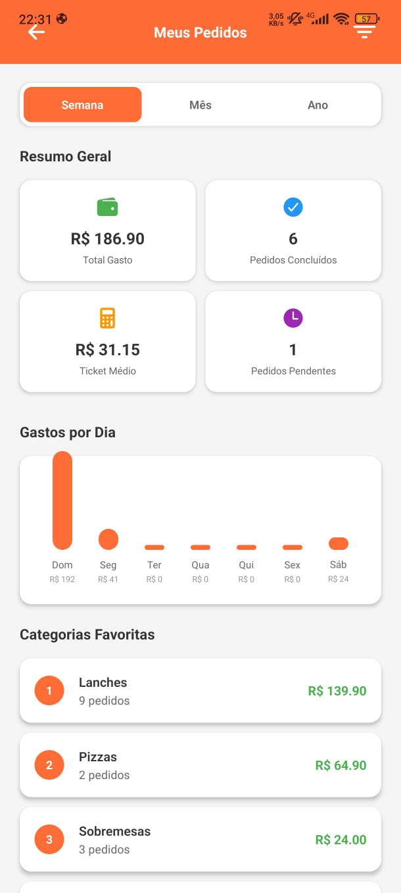
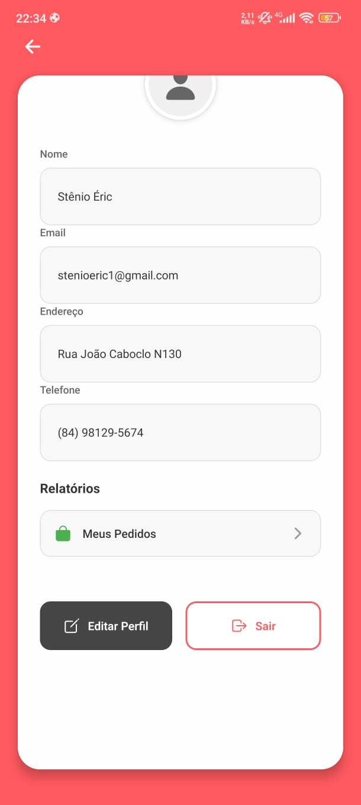

# 🍕 IpuFood - Food Delivery App

<div align="center">


**Um aplicativo completo de delivery de comida desenvolvido em React Native com Firebase**

[🚀 Funcionalidades](#-funcionalidades) • [📱 Screenshots](#-screenshots) • [🛠️ Tecnologias](#️-tecnologias) • [⚙️ Instalação](#️-instalação) • [🏗️ Arquitetura](#️-arquitetura) • [📊 API](#-api)

</div>

---

## 🚀 Funcionalidades

### 👤 Sistema de Usuários
- **Autenticação completa** com Firebase Auth
- **Sistema de roles** (Admin/Cliente)
- **Perfil personalizado** com dados editáveis
- **Registro de novos usuários**

### 🍽️ Sistema de Produtos
- **Catálogo dinâmico** de produtos
- **CRUD completo** para administradores
- **Detalhes do produto** com imagens
- **Categorização** de produtos

### 🛒 Carrinho de Compras
- **Carrinho global** com Context API
- **Adicionar/remover** produtos
- **Cálculo automático** de totais
- **Persistência** de dados

### 📋 Sistema de Pedidos
- **Criação de pedidos** integrada ao Firestore
- **Status tracking** (Pendente, Confirmado, Preparando, Entregando, Entregue, Cancelado)
- **Confirmação de entrega** para administradores
- **Histórico completo** de pedidos

### 📊 Relatórios Avançados
- **Relatório de Vendas** (Admin)
  - Resumo geral de vendas
  - Gráficos de receita por período
  - Top produtos mais vendidos
  - Filtros por período (semana/mês/ano)
- **Relatório de Compras** (Cliente)
  - Resumo de gastos pessoais
  - Gráficos de gastos por dia
  - Categorias favoritas
  - Histórico de pedidos

### 💳 Sistema de Pagamento
- **Múltiplos métodos** (Cartão, PIX, Dinheiro)
- **Processamento** de pagamentos
- **Confirmação** de transações

### 🎨 Interface Moderna
- **Design responsivo** e intuitivo
- **Navegação fluida** com React Navigation
- **Ícones personalizados** e animações
- **Tema consistente** em todo o app

## 📱 Screenshots

<div align="center">

### 🏠 Tela Principal


### 🛒 Carrinho


### 📊 Relatórios


### 👤 Perfil


</div>

## 🛠️ Tecnologias

### Frontend
- **React Native** 0.79.3 - Framework mobile
- **Expo** 53.0.11 - Plataforma de desenvolvimento
- **TypeScript** 5.8.3 - Tipagem estática
- **React Navigation** 7.x - Navegação entre telas
- **React Hook Form** 7.60.0 - Gerenciamento de formulários
- **Yup** 1.6.1 - Validação de schemas

### Backend & Serviços
- **Firebase** 11.10.0
  - **Authentication** - Autenticação de usuários
  - **Firestore** - Banco de dados NoSQL
  - **Real-time updates** - Sincronização em tempo real

### UI/UX
- **Expo Vector Icons** - Ícones personalizados
- **Expo Google Fonts** - Tipografia customizada
- **React Native Safe Area Context** - Adaptação a diferentes telas

## ⚙️ Instalação

### Pré-requisitos
- Node.js 18+ 
- npm ou yarn
- Expo CLI (`npm install -g @expo/cli`)
- Android Studio (para Android) ou Xcode (para iOS)

### 1. Clone o Repositório
```bash
git clone https://github.com/stenioeric/ipufood.git
cd ipufood
```

### 2. Instale as Dependências
```bash
npm install
# ou
yarn install
```

### 3. Configure o Firebase

#### 3.1 Crie um Projeto Firebase
1. Acesse [console.firebase.google.com](https://console.firebase.google.com)
2. Clique em "Adicionar projeto"
3. Siga o assistente de configuração

#### 3.2 Configure a Autenticação
1. Vá para **Authentication** > **Sign-in method**
2. Habilite **Email/Password**
3. Opcional: Configure outros métodos (Google, Facebook)

#### 3.3 Configure o Firestore
1. Vá para **Firestore Database**
2. Crie um banco de dados em **modo de teste**
3. Configure as regras de segurança:

```javascript
rules_version = '2';
service cloud.firestore {
  match /databases/{database}/documents {
    // Usuários podem ler/escrever seus próprios dados
    match /users/{userId} {
      allow read, write: if request.auth != null && request.auth.uid == userId;
    }
    
    // Pedidos: usuários podem criar, admins podem ler todos
    match /orders/{orderId} {
      allow create: if request.auth != null;
      allow read, write: if request.auth != null && 
        (resource.data.userId == request.auth.uid || 
         get(/databases/$(database)/documents/users/$(request.auth.uid)).data.role == 'admin');
    }
    
    // Produtos: todos podem ler, admins podem escrever
    match /products/{productId} {
      allow read: if true;
      allow write: if request.auth != null && 
        get(/databases/$(database)/documents/users/$(request.auth.uid)).data.role == 'admin';
    }
  }
}
```

#### 3.4 Obtenha as Credenciais
1. Vá para **Configurações do projeto** > **Geral**
2. Role até "Seus apps" e clique em **"Adicionar app"** > **Web**
3. Copie as credenciais

#### 3.5 Configure no Projeto
1. Abra `src/services/firebase.ts`
2. Substitua as credenciais de exemplo pelas suas reais:

```typescript
const firebaseConfig = {
  apiKey: "sua-api-key",
  authDomain: "seu-projeto.firebaseapp.com",
  projectId: "seu-projeto",
  storageBucket: "seu-projeto.appspot.com",
  messagingSenderId: "123456789",
  appId: "1:123456789:web:abcdef123456"
};
```

### 4. Popule o Banco de Dados
```bash
node scripts/seedDatabase.js
```

Isso criará:
- **Usuário Admin:** `admin@ipufood.com` / `admin123`
- **Usuário Cliente:** `cliente@ipufood.com` / `cliente123`
- **Produtos de exemplo**
- **Pedidos de teste**

### 5. Execute o Projeto
```bash
# Iniciar o servidor de desenvolvimento
npm start

# Executar no Android
npm run android

# Executar no iOS
npm run ios

# Executar na web
npm run web
```

## 🏗️ Arquitetura

```
src/
├── 📁 assets/              # Imagens, fontes e recursos estáticos
├── 📁 components/          # Componentes reutilizáveis
│   ├── Button.tsx         # Botões customizados
│   ├── Input.tsx          # Campos de entrada
│   └── Loading.tsx        # Componente de carregamento
├── 📁 context/            # Context API para estado global
│   ├── UserContext.tsx    # Contexto do usuário logado
│   └── CartContext.tsx    # Contexto do carrinho de compras
├── 📁 hooks/              # Custom hooks
├── 📁 navigation/         # Configuração de navegação
│   ├── AppNavigator.tsx   # Navegador principal
│   ├── AuthNavigator.tsx  # Navegador de autenticação
│   └── TabNavigator.tsx   # Navegador de abas
├── 📁 screens/            # Telas do aplicativo
│   ├── 📁 Auth/          # Telas de autenticação
│   │   ├── LoginScreen.tsx
│   │   └── RegisterScreen.tsx
│   ├── 📁 Menu/          # Telas do menu
│   │   └── MenuScreen.tsx
│   ├── 📁 Product/       # Telas de produtos
│   │   ├── ProductListScreen.tsx
│   │   ├── ProductDetailScreen.tsx
│   │   └── ProductEditScreen.tsx
│   ├── 📁 Cart/          # Telas do carrinho
│   │   └── CartScreen.tsx
│   ├── 📁 Orders/        # Telas de pedidos
│   │   └── OrdersScreen.tsx
│   ├── 📁 Profile/       # Telas de perfil
│   │   └── ProfileScreen.tsx
│   ├── 📁 Reports/       # Telas de relatórios
│   │   ├── SalesReportScreen.tsx
│   │   └── PurchaseReportScreen.tsx
│   ├── 📁 Payment/       # Telas de pagamento
│   │   └── PaymentScreen.tsx
│   └── 📁 Confirmation/  # Telas de confirmação
│       └── ConfirmationScreen.tsx
├── 📁 services/           # Serviços e integrações
│   ├── firebase.ts       # Configuração do Firebase
│   ├── userService.ts    # Serviços de usuário
│   ├── productService.ts # Serviços de produto
│   └── orderService.ts   # Serviços de pedidos
├── 📁 types/             # Definições de tipos TypeScript
│   ├── user.ts           # Tipos de usuário
│   ├── product.ts        # Tipos de produto
│   └── order.ts          # Tipos de pedido
├── 📁 utils/             # Utilitários e helpers
└── 📁 scripts/           # Scripts utilitários
    └── seedDatabase.js   # Script para popular o banco
```

## 📊 API

### Estrutura do Banco de Dados

#### Coleção: `users`
```typescript
interface User {
  id: string;
  name: string;
  email: string;
  phone: string;
  address: string;
  role: 'admin' | 'user';
  createdAt: Timestamp;
  updatedAt: Timestamp;
}
```

#### Coleção: `products`
```typescript
interface Product {
  id: string;
  name: string;
  description: string;
  price: number;
  category: string;
  imageUrl?: string;
  available: boolean;
  createdAt: Timestamp;
  updatedAt: Timestamp;
}
```

#### Coleção: `orders`
```typescript
interface Order {
  id: string;
  userId: string;
  userName: string;
  items: OrderItem[];
  total: number;
  status: 'pending' | 'confirmed' | 'preparing' | 'delivering' | 'delivered' | 'cancelled';
  paymentMethod: 'credit' | 'pix' | 'cash';
  createdAt: Timestamp;
  deliveredAt?: Timestamp;
}

interface OrderItem {
  productId: string;
  productName: string;
  quantity: number;
  price: number;
  total: number;
}
```

### Serviços Principais

#### UserService
```typescript
// Autenticação
signIn(email: string, password: string): Promise<User>
signUp(userData: UserData): Promise<User>
signOut(): Promise<void>

// CRUD de usuários
getUser(id: string): Promise<User>
updateUser(id: string, data: Partial<User>): Promise<void>
```

#### ProductService
```typescript
// CRUD de produtos
getProducts(): Promise<Product[]>
getProduct(id: string): Promise<Product>
createProduct(data: ProductData): Promise<Product>
updateProduct(id: string, data: Partial<Product>): Promise<void>
deleteProduct(id: string): Promise<void>
```

#### OrderService
```typescript
// CRUD de pedidos
getOrders(): Promise<Order[]>
getUserOrders(userId: string): Promise<Order[]>
createOrder(orderData: OrderData): Promise<Order>
updateOrderStatus(id: string, status: OrderStatus): Promise<void>
```

## 🎯 Como Usar

### Login Inicial
- **Admin:** `admin@ipufood.com` / `admin123`
- **Cliente:** `cliente@ipufood.com` / `cliente123`

### Fluxo do Usuário Cliente
1. **Login** com credenciais
2. **Navegar** pelo menu de produtos
3. **Adicionar** produtos ao carrinho
4. **Finalizar** pedido com pagamento
5. **Acompanhar** status do pedido
6. **Visualizar** histórico de compras

### Fluxo do Administrador
1. **Login** como admin
2. **Gerenciar** produtos (CRUD)
3. **Visualizar** pedidos pendentes
4. **Confirmar** entregas
5. **Analisar** relatórios de vendas
6. **Monitorar** performance do negócio

## 🔧 Scripts Disponíveis

```bash
# Desenvolvimento
npm start          # Inicia o servidor de desenvolvimento
npm run android    # Executa no Android
npm run ios        # Executa no iOS
npm run web        # Executa na web

# Banco de dados
node scripts/seedDatabase.js  # Popula o banco com dados iniciais
```

## 🚀 Deploy

### Android
```bash
# Build para produção
expo build:android

# Ou usando EAS Build
eas build --platform android
```

### iOS
```bash
# Build para produção
expo build:ios

# Ou usando EAS Build
eas build --platform ios
```

### Web
```bash
# Build para produção
expo build:web
```

## 🤝 Contribuição

1. **Fork** o projeto
2. **Crie** uma branch para sua feature (`git checkout -b feature/AmazingFeature`)
3. **Commit** suas mudanças (`git commit -m 'Add some AmazingFeature'`)
4. **Push** para a branch (`git push origin feature/AmazingFeature`)
5. **Abra** um Pull Request

### Padrões de Código
- Use **TypeScript** para todas as novas funcionalidades
- Siga o **ESLint** configurado
- Escreva **testes** para novas funcionalidades
- Documente **APIs** e componentes complexos

## 📋 Roadmap

### ✅ Concluído
- [x] Sistema de autenticação
- [x] CRUD de produtos
- [x] Carrinho de compras
- [x] Sistema de pedidos
- [x] Relatórios básicos
- [x] Interface responsiva

### 🚧 Em Desenvolvimento
- [ ] Notificações push
- [ ] Geolocalização
- [ ] Avaliações e comentários
- [ ] Cupons de desconto

### 📅 Planejado
- [ ] Integração com pagamentos reais
- [ ] Sistema de delivery tracking
- [ ] Chat entre cliente e restaurante
- [ ] Múltiplos restaurantes
- [ ] App para entregadores

## 🐛 Problemas Conhecidos

- [ ] Performance em listas grandes de produtos
- [ ] Cache de imagens não implementado
- [ ] Offline mode limitado

## 📞 Suporte

- **Issues:** [GitHub Issues](https://github.com/seu-usuario/ipufood/issues)
- **Email:** suporte@ipufood.com
- **Documentação:** [Wiki do Projeto](https://github.com/seu-usuario/ipufood/wiki)

## 📄 Licença

Este projeto está sob a licença MIT. Veja o arquivo [LICENSE](LICENSE) para mais detalhes.

---

<div align="center">

**Desenvolvido com ❤️ pela equipe IpuFood**

[](https://github.com/seu-usuario/ipufood/stargazers)
[](https://github.com/seu-usuario/ipufood/network)
[](https://github.com/seu-usuario/ipufood/issues)

</div> 